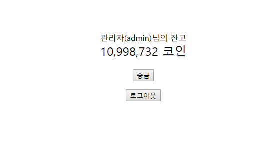

# Project-Coin180
php + MySQL을 사용한 온라인 화폐 시스템 "Coin180"

connect.php, savuser.php, send.php

위의 3가지 파일은 MySQL DB에 연결되는 코드가 있는 파일입니다.

Username : root

Password : root

으로 기본값이 설정되어 있으니, 그에 맞추어 사용 또는 수정하시고 사용하시면 될 것 같습니다.

예시 화면입니다. apache2 서버의 경우 정상적으로 작동합니다.
